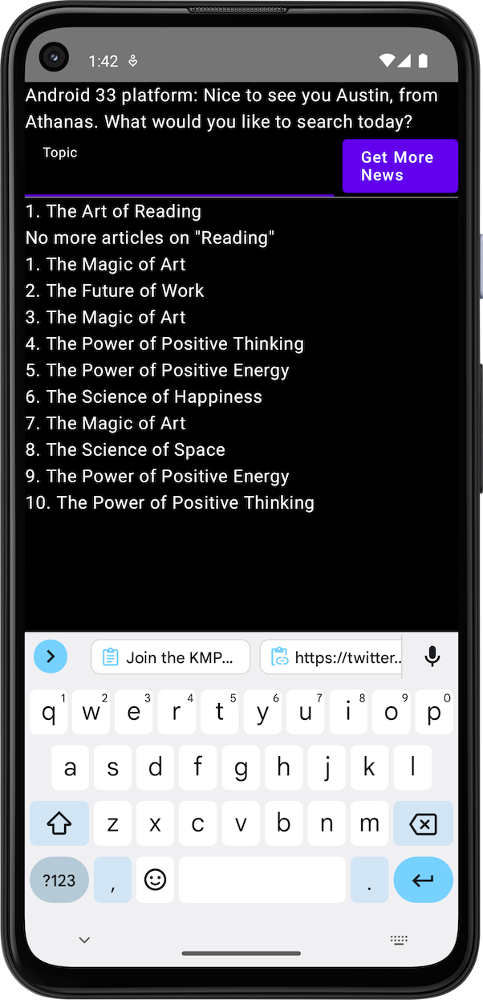
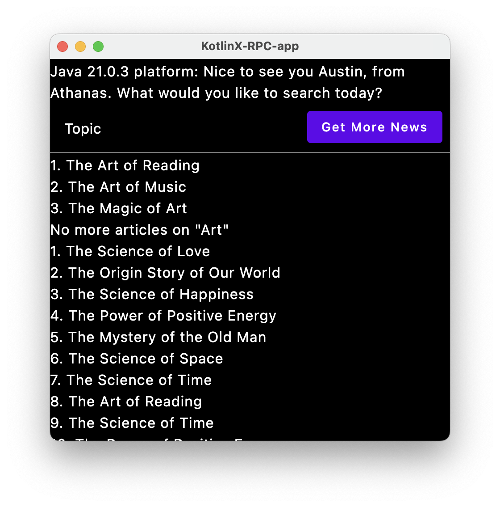
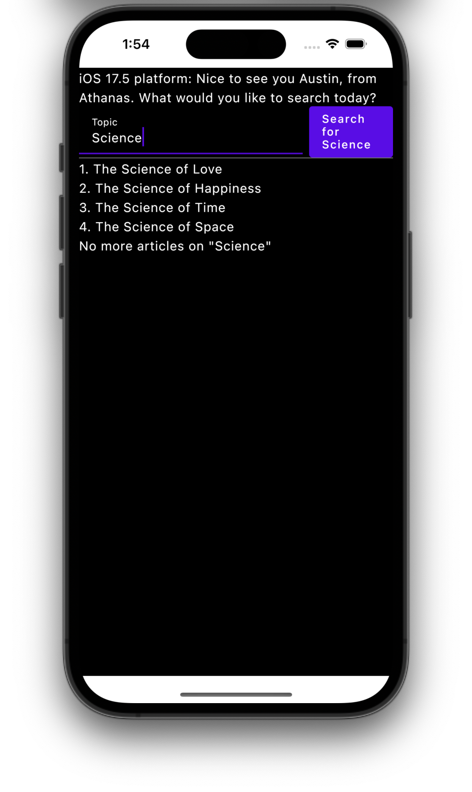

# YOU DON'T HAVE TO USE REST FOR API's!!!

### About
This is a Kotlin Multiplatform project targeting Android, iOS, Desktop & Ktor Server 
demonstrating the new KotlinX Remote Procedure Call (kRPC) library. It makes RPC-based systems very easy to build.

KotlinX RPC radically simplifies creating streaming, type-safe, secure, efficient communication between your front-end applications and the back-end server, with nearly zero boilerplate. 

### Just Kotlin interfaces!

- How RPC services are defined and implemented in a shared module.
- How to reconnect and ping the RPC server.
- How to send a request to the server and receive a response.
- How to send a request to the server and receive a stream of responses.

- Explainer Video:
  - 

* Note: 
  * Use Android Studio to run the iOS app on a simulator or a physical device.
  * Use IntelliJ IDEA to run the Desktop app, Android app & server.
  * Android Studio can run the Android app too.
  * You can also run the iOS app on a physical device using Xcode.
  * You can run the server on a cloud server or your local machine.
  
* IP Address
  * For local running of the server, use your local IP address (from your system network settings).
  * Don't use `127.0.0.1` or `localhost` as the server address, as emulators and simulators can't access it.
  * Make sure to update the "[network_security_config.xml](composeApp/src/androidMain/res/xml/network_security_config.xml)" file in the Android app to allow network access to your server.

* `/composeApp` is for code that will be shared across your Compose Multiplatform applications.
  It contains several subfolders:
  - `commonMain` is for code that’s common for all targets.
  - Other folders are for Kotlin code that will be compiled for only the platform indicated in the folder name.
    - like `androidMain` for Android, `desktopMain` for Desktop, `iosMain` for iOS.

* `/iosApp` contains iOS applications. Even if you’re sharing your UI with Compose Multiplatform, 
  you need this entry point for your iOS app. This is also where you should add SwiftUI code for your project.

*`/server` is for the Ktor server application.

*`/shared` is where you put the common RPC service interface.

This project is generated by [the KMP wizard](https://kmp.jetbrains.com) and slightly modified to showcase kRPC usage.
Learn more about [Kotlin Multiplatform](https://www.jetbrains.com/help/kotlin-multiplatform-dev/get-started.html),
[Compose Multiplatform](https://github.com/JetBrains/compose-multiplatform/#compose-multiplatform),

## More Resources
- Check out the KMP Developers Group on Twitter: https://twitter.com/i/communities/1739883885658607808
- Here's my famous programming course ["How to Program From The Ground Up"](https://github.com/realityexpander/How_to_program_from_ground_up) on YouTube

# Run configurations

If your [developmant environment is set up correctly](https://www.jetbrains.com/help/kotlin-multiplatform-dev/compose-multiplatform-setup.html),
[Fleet](https://www.jetbrains.com/fleet/) will provide you with all needed run configurations.
If you don't use Fleet, you can check out [this guide](https://www.jetbrains.com/help/kotlin-multiplatform-dev/compose-multiplatform-create-first-app.html#run-your-application)
on running KMP projects.

# Built Using:
IntelliJ IDEA 2024.2 (Community Edition)
Build #IC-242.20224.300, built on August 6, 2024
Runtime version: 21.0.3+13-b509.4 aarch64 (JCEF 122.1.9)
VM: OpenJDK 64-Bit Server VM by JetBrains s.r.o.
Toolkit: sun.lwawt.macosx.LWCToolkit
macOS 14.5
GC: G1 Young Generation, G1 Concurrent GC, G1 Old Generation
Memory: 3048M
Cores: 10
Metal Rendering is ON
Registry:
ide.experimental.ui=true
Non-Bundled Plugins:
com.c5inco.modifiers (1.0.15)
com.github.DerekBum.composeSlidesPresenter (0.1.2)
com.github.fisherman08.Idea-WebSocket (1.0.1)
wu.seal.tool.jsontokotlin (3.7.4)
org.jetbrains.plugins.hocon (2024.2.0)
com.intellij.mermaid (0.0.22+IJ.232)
com.wakatime.intellij.plugin (15.0.1)
com.jetbrains.space (242.20224.155)
net.ashald.envfile (3.4.2)
com.jetbrains.edu (2024.7-2024.2-317)
com.intellij.ml.llm (242.20224.331)
DBN (3.4.4179.0)
com.intellij.grazie.pro (0.3.326)
com.google.CoroutineStacks (1.0.2)
com.jetbrains.packagesearch.intellij-plugin (242.0.12)
org.jetbrains.android (242.20224.300)
com.eric-li.layout-inspector-v2 (1.0.6)
androidx.compose.plugins.idea (242.20224.159)
org.jetbrains.compose.desktop.ide (1.6.2)
com.github.copilot (1.5.17.6356)
com.intellij.java.rareRefactorings (242.20224.159)
org.jetbrains.settingsRepository (242.20224.155)
Kotlin: 242.20224.300-IJ

Android Studio Ladybug | 2024.1.3 Canary 3
Build #AI-241.18034.62.2413.12138059, built on July 25, 2024
Runtime version: 21.0.3+-77717980-b509.4 aarch64
VM: OpenJDK 64-Bit Server VM by JetBrains s.r.o.
macOS 14.5
GC: G1 Young Generation, G1 Concurrent GC, G1 Old Generation
Memory: 4096M
Cores: 10
Metal Rendering is ON
Registry:
ide.tooltip.initialDelay=812
ide.browser.jcef.gpu.disable=true
debugger.new.tool.window.layout=true
analyze.exceptions.on.the.fly=true
ide.experimental.ui=true
Non-Bundled Plugins:
com.github.airsaid.androidlocalize (3.0.0)
com.wakatime.intellij.plugin (15.0.1)
wu.seal.tool.jsontokotlin (3.7.4)
mobi.hsz.idea.gitignore (4.5.3)
dev.j-a.swift (1.1.0.354-241)
com.c5inco.modifiers (1.0.15)
DBN (3.4.4179.0)
net.seesharpsoft.intellij.plugins.csv (3.3.0-241)
com.github.copilot (1.5.17.6356)
by.overpass.svg-to-compose-intellij (0.16)
org.jetbrains.compose.desktop.ide (1.6.2)
com.abeade.plugin.figma.import (1.3.1)
com.developerphil.adbidea (1.6.17)
com.squareup.sqldelight (2.0.2)
com.jetbrains.kmm (0.8.3(241)-9)

